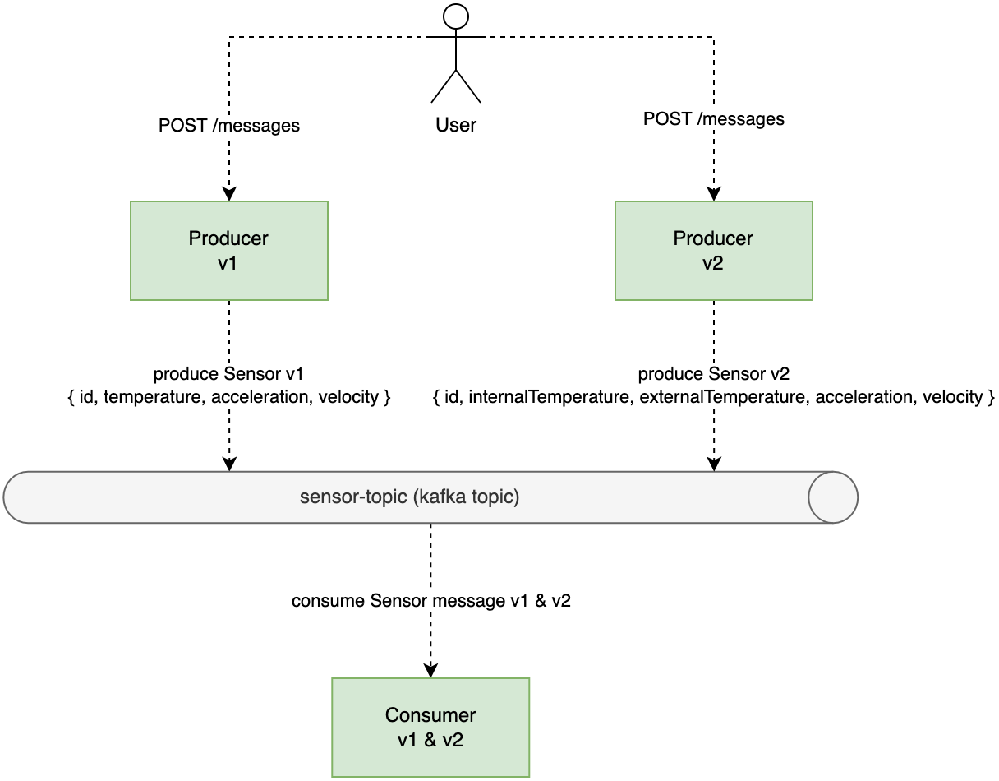

[](https://github.com/rogervinas/spring-cloud-stream-kafka-avro-schema-registry/actions/workflows/ci.yml)


# Spring Cloud Stream Kafka & Confluent Avro Schema Registry

Spring Cloud Stream uses Json serializers by default, but maybe you want to consider [using Avro serializers](https://www.confluent.io/blog/avro-kafka-data):
- It is faster to serialize/deserialize.
- It uses a more compact binary form.
- You can define a schema and compatibility rules between schema versions.

In this demo, based on the [spring-cloud-stream-schema-registry-integration sample](https://github.com/spring-cloud/spring-cloud-stream-samples/tree/main/spring-cloud-stream-schema-registry-integration), we will create three Spring Cloud Stream applications, one consumer and two producers, all of them using the [Confluent Schema Registry Server](https://docs.confluent.io/platform/current/schema-registry/index.html) and the [Confluent Avro Serializers](https://docs.confluent.io/platform/current/schema-registry/serdes-develop/serdes-avro.html).



As you can see in the diagram, the consumer should be able to consume both Sensor v1 and v2 messages.

Ready? Let's do it! 🚀

* [Creating the project](#creating-the-project)
* [Implementing the Producer v1](#implementing-the-producer-v1)
  * [Testing the Producer v1](#testing-the-producer-v1)
* [Implementing the Producer v2](#implementing-the-producer-v2)
* [Implementing the Consumer](#implementing-the-consumer)
    * [Testing the Consumer](#testing-the-consumer)
* [Test this demo](#test-this-demo)
* [Run this demo](#run-this-demo)
* See also
    * :octocat: [Spring Cloud Stream Kafka step by step](https://github.com/rogervinas/spring-cloud-stream-kafka-step-by-step)
    * :octocat: [Spring Cloud Stream & Kafka Streams Binder first steps](https://github.com/rogervinas/spring-cloud-stream-kafka-streams-first-steps)
    * :octocat: [Spring Cloud Stream Multibinder](https://github.com/rogervinas/spring-cloud-stream-multibinder)
    * :octocat: [Spring Cloud Stream & Kafka Streams Binder + Processor API](https://github.com/rogervinas/spring-cloud-stream-kafka-streams-processor)

You can browse older versions of this repo:
* [Spring Boot 2.x](https://github.com/rogervinas/spring-cloud-stream-kafka-confluent-avro-schema-registry/tree/spring-boot-2.x)

## Creating the project

Just to keep it simple we will put the consumer and the two producers as modules of a gradle multi-module project, with a little help of [spring initializr](https://start.spring.io).

As we do not use maven like the [spring-cloud-stream-schema-registry-integration sample](https://github.com/spring-cloud/spring-cloud-stream-samples/tree/main/spring-cloud-stream-schema-registry-integration), we cannot use the official [avro-maven-plugin](https://avro.apache.org/docs/current/gettingstartedjava.html). We will use [davidmc24/gradle-avro-plugin](https://github.com/davidmc24/gradle-avro-plugin) instead.

We will use a [docker-compose.yml](docker-compose.yml) based on the one from [confluent/cp-all-in-one](https://github.com/confluentinc/cp-all-in-one/blob/7.2.1-post/cp-all-in-one/docker-compose.yml) both to run it locally and to execute the integration tests. From that configuration we will keep only the containers: **zookeeper**, **broker**, **schema-registry** and **control-center**.

Confluent **control-center** is not really needed, but it may be interesting to take a look at its admin console at http://localhost:9021 when running the demo locally.

We use [`SCHEMA_COMPATIBILITY_LEVEL = none`](docker-compose.yml#L52) but you can play with the other ones as documented in [Confluent Schema Evolution and Compatibility](https://docs.confluent.io/platform/current/schema-registry/avro.html#schema-evolution-and-compatibility).

## Implementing the Producer v1

This producer will send Sensor messages in v1 format as specified in [producer1/avro/sensor.avsc](producer1/src/main/avro/sensor.avsc):
```json
{
  "namespace" : "com.example",
  "type" : "record",
  "name" : "Sensor",
  "fields" : [
    {"name":"id","type":"string"},
    {"name":"temperature", "type":"float", "default":0.0},
    {"name":"acceleration", "type":"float","default":0.0},
    {"name":"velocity","type":"float","default":0.0}
  ]
}
```

The [davidmc24/gradle-avro-plugin](https://github.com/davidmc24/gradle-avro-plugin) will generate java code similar to:
```java
public class Sensor {
    public Sensor(String id, Float temperature, Float acceleration, Float velocity) {
        this.id = id;
        this.temperature = temperature;
        this.acceleration = acceleration;
        this.velocity = velocity;
    }
    
    // Getters and Setters
}
```

Using this configuration:
```yaml
spring:
  cloud:
    function:
      definition: "myProducer"
    stream:
      bindings:
        myProducer-out-0:
          destination: sensor-topic
          producer:
            useNativeEncoding: true
      kafka:
        binder:
          brokers: localhost:9092
        bindings:
          myProducer-out-0:
            producer:
              configuration:
                value.serializer: io.confluent.kafka.serializers.KafkaAvroSerializer
                schema.registry.url: http://localhost:8081
```

Then Spring Cloud Stream:
* Will expect us to implement a @Bean named `myProducer` returning a value or a `Flux` of values:
  * In **Kotlin** we can use a lambda `() -> Value` or `() -> Flux<Value>`.
  * In **Java** we can use a `Supplier<Value>` or `Supplier<Flux<Value>>`.
* Will call this @Bean one or many times to retrieve the values to be published.
* Will connect to a kafka broker on `localhost:9092`.
* Will use the confluent `KafkaAvroSerializer` and connect to the schema registry server on `localhost:8081`.

For simplicity, we put everything in the same Application class, including the RestController:
```kotlin
@SpringBootApplication
@RestController
class Application {

  private val version = "v1"
  private val unbounded: BlockingQueue<Sensor> = LinkedBlockingQueue()
  @Autowired private lateinit var random: Random

  @Bean
  fun myProducer(): () -> Sensor? = { unbounded.poll() }

  @RequestMapping(value = ["/messages"], method = [RequestMethod.POST])
  fun sendMessage(): String {
    unbounded.offer(randomSensor())
    return "ok, have fun with $version payload!"
  }

  private fun randomSensor() = Sensor().apply {
    this.id = random.nextInt(1000, 9999).toString() + "-$version"
    this.acceleration = random.nextFloat() * 10
    this.velocity = random.nextFloat() * 100
    this.temperature = random.nextFloat() * 50
  }
}

fun main(args: Array<String>) {
  runApplication<Application>(*args)
}
```

To generate a random Sensor message we will use this Random @Bean, that we could mock for the integration test:
```kotlin
@Configuration
class RandomConfiguration { 
  @Bean
  fun random() = Random(System.nanoTime())
}
```

### Testing the Producer v1

To test the producer we will use [Testcontainers](https://www.testcontainers.org/test_framework_integration/junit_5/) to start docker compose. For simplicity, we will use fixed ports but take into account that it may be better to use random ports and set system properties to override the configuration values for the kafka broker url and the schema registry url.

To verify that the producer is indeed producing messages we will consume them using a simple [KafkaConsumer using the Avro Deserializer](https://docs.confluent.io/platform/current/schema-registry/serdes-develop/serdes-avro.html#avro-deserializer):
```kotlin
@Test
fun `should produce sensor v1 message`() {
  KafkaConsumer<String, GenericRecord>(consumerProperties()).use { consumer ->
    // Subscribe to topic
    consumer.subscribe(listOf(SENSOR_TOPIC))

    // Consume previous messages (just in case)
    consumer.poll(TIMEOUT)

    // Produce one message
    WebTestClient
      .bindToServer()
      .baseUrl("http://localhost:$serverPort")
      .build()
      .post().uri("/messages").exchange()
      .expectStatus().isOk
      .expectBody(String::class.java).isEqualTo("ok, have fun with v1 payload!")

    // Consume message
    assertThat(consumer.poll(TIMEOUT)).singleElement().satisfies(Consumer { record ->
      val value = record.value()
      assertThat(value["id"]).isEqualTo("2376-v1")
      assertThat(value["temperature"]).isEqualTo(33.067642f)
      assertThat(value["acceleration"]).isEqualTo(3.2810485f)
      assertThat(value["velocity"]).isEqualTo(84.885544f)
    })
  }
}
```

To generate always the same result, we will override the Random @Bean with one with a fixed seed:
```kotlin
@Configuration
class RandomTestConfiguration {
  @Bean @Primary
  fun randomTest() = Random(0)
}
```

## Implementing the Producer v2

This producer will send Sensor messages in v2 format as specified in [producer2/avro/sensor.avsc](producer2/src/main/avro/sensor.avsc):
```json
{
  "namespace" : "com.example",
  "type" : "record",
  "name" : "Sensor",
  "fields" : [
    {"name":"id","type":"string"},
    {"name":"internalTemperature", "type":"float", "default":0.0},
    {"name":"externalTemperature", "type":"float", "default":0.0},
    {"name":"acceleration", "type":"float","default":0.0},
    {"name":"velocity","type":"float","default":0.0},
    {"name":"accelerometer","type":[
      "null",{
        "type":"array",
        "items":"float"
      }
    ]},
    {"name":"magneticField","type":[
      "null",{
        "type":"array",
        "items":"float"
      }
    ]}
  ]
}
```

Note that this new version:
* Splits the `temperature` field in two: `internalTemperature` and `externalTemperature`.
* Adds two new optional fields: `accelerometer` and `magneticField`.

Implementing and testing this producer is done the same as the v1 one.

## Implementing the Consumer

For the consumer to be able to consume Sensor v1 and v2 messages we define the schema in [consumer/avro/sensor.avsc](consumer/src/main/avro/sensor.avsc) as:
```json
{
  "namespace" : "com.example",
  "type" : "record",
  "name" : "Sensor",
  "fields" : [
    {"name":"id","type":"string"},
    {"name":"internalTemperature", "type":"float", "default":0.0, "aliases":["temperature"]},
    {"name":"externalTemperature", "type":"float", "default":0.0},
    {"name":"acceleration", "type":"float","default":0.0},
    {"name":"velocity","type":"float","default":0.0}
  ]
}
```

So if it receives a v1 message:
* `temperature` field would be mapped to `internalTemperature`.
* `externalTemperature` field would be 0.

Then, using this configuration:
```yaml
spring:
  cloud:
    function:
      definition: "myConsumer"
    stream:
      bindings:
        myConsumer-in-0:
          destination: sensor-topic
          consumer:
            useNativeDecoding: true
      kafka:
        binder:
          brokers: localhost:9092
        bindings:
          myConsumer-in-0:
            consumer:
              configuration:
                value.deserializer: io.confluent.kafka.serializers.KafkaAvroDeserializer
                schema.registry.url: http://localhost:8081
                specific.avro.reader: true
```

Spring Cloud Stream:
* Will expect us to implement a @Bean named `myConsumer` accepting a value:
  * In **Kotlin** we can use a lambda `(Value) -> Unit`.
  * In **Java** we can use a `Consumer<Value>`.
* Will call this @Bean every time a value is consumed.
* Will connect to a kafka broker on `localhost:9092`.
* Will use the confluent `KafkaAvroDeserializer` and connect to the schema registry server on `localhost:8081`.

So for the sake of a demo the implementation can be as simple as:
```kotlin
@SpringBootApplication
class Application {
  @Bean
  fun myConsumer(): (Sensor) -> Unit = { println("Consumed $it") }
}

fun main(args: Array<String>) {
  runApplication<Application>(*args)
}
```

### Testing the Consumer

Same as for the producers, to test the consumer we will use [Testcontainers](https://www.testcontainers.org/test_framework_integration/junit_5/) to start docker compose.

To produce test messages we will use a simple [KafkaProducer using the Avro Serializer](https://docs.confluent.io/platform/current/schema-registry/serdes-develop/serdes-avro.html#avro-serializer):

First of all we will mock the `process` @Bean so we can verify it has been called:
```kotlin
@MockBean(name = "myConsumer")
private lateinit var myConsumer: (Sensor) -> Unit
```

Then we test that we can consume Sensor v1 messages:
```kotlin
@Test
fun `should consume sensor v1 message`() {
  val id = UUID.randomUUID().toString()
  val temperature = 34.98f
  val acceleration = 9.81f
  val velocity = 15.73f
  
  val recordV1 = createRecord(
    schema = """
    {
      "namespace" : "com.example",
      "type" : "record",
      "name" : "Sensor",
      "fields" : [
        {"name":"id","type":"string"},
        {"name":"temperature", "type":"float", "default":0.0},
        {"name":"acceleration", "type":"float","default":0.0},
        {"name":"velocity","type":"float","default":0.0}
      ]
    }
  """.trimIndent()
  ).apply {
    put("id", id)
    put("temperature", temperature)
    put("acceleration", acceleration)
    put("velocity", velocity)
  }
  
  produceRecord(id, recordV1)
  
  verify(myConsumer, timeout(TIMEOUT.toMillis()))
    .invoke(Sensor(id, temperature, 0f, acceleration, velocity))
}
```

And we test that we can consume Sensor v2 messages:
```kotlin
@Test
fun `should consume sensor v2 message`() {
 val id = UUID.randomUUID().toString()
 val internalTemperature = 34.98f
 val externalTemperature = 54.16f
 val acceleration = 9.81f
 val velocity = 15.73f
 
 val recordV2 = createRecord(
   schema = """
   {
     "namespace" : "com.example",
     "type" : "record",
     "name" : "Sensor",
     "fields" : [
       {"name":"id","type":"string"},
       {"name":"internalTemperature", "type":"float", "default":0.0},
       {"name":"externalTemperature", "type":"float", "default":0.0},
       {"name":"acceleration", "type":"float","default":0.0},
       {"name":"velocity","type":"float","default":0.0},
       {"name":"accelerometer","type":["null",{"type":"array","items":"float"}]},
       {"name":"magneticField","type":["null",{"type":"array","items":"float"}]}
     ]
   }
 """.trimIndent()
 ).apply {
   put("id", id)
   put("internalTemperature", internalTemperature)
   put("externalTemperature", externalTemperature)
   put("acceleration", acceleration)
   put("velocity", velocity)
   put("accelerometer", listOf(1.1f, 2.2f, 3.3f))
   put("magneticField", listOf(4.4f, 5.5f, 6.6f))
 }
 
 produceRecord(id, recordV2)
 
 verify(myConsumer, timeout(TIMEOUT.toMillis()))
   .invoke(Sensor(id, internalTemperature, externalTemperature, acceleration, velocity))
}
```

That's it! Happy coding! 💙

## Test this demo

```shell
./gradlew test
```

## Run this demo

* Start:
```shell
docker compose up -d

./gradlew consumer:bootRun
./gradlew producer1:bootRun
./gradlew producer2:bootRun
```

* Confluent control center at http://localhost:9021

* Produce v1 payload:
```shell
curl -X POST http://localhost:9001/messages
```

* Produce v2 payload:
```shell
curl -X POST http://localhost:9002/messages
```

* Alternatively you can consume with [kcat](https://docs.confluent.io/platform/current/app-development/kafkacat-usage.html):
```shell
kcat -b localhost:9092 -t sensor-topic -s avro -r http://localhost:8081
```

## Links

* [Confluent All-in-One Docker Compose](https://github.com/confluentinc/cp-all-in-one/blob/7.2.1-post/cp-all-in-one/docker-compose.yml)
* [Confluent Docker Configuration Parameters](https://docs.confluent.io/platform/current/installation/docker/config-reference.html)
* [Confluent Schema Evolution and Compatibility](https://docs.confluent.io/platform/current/schema-registry/avro.html#schema-evolution-and-compatibility)
* [Spring Cloud Schema Registry](https://docs.spring.io/spring-cloud-schema-registry/docs/current/reference/html/spring-cloud-schema-registry.html)
